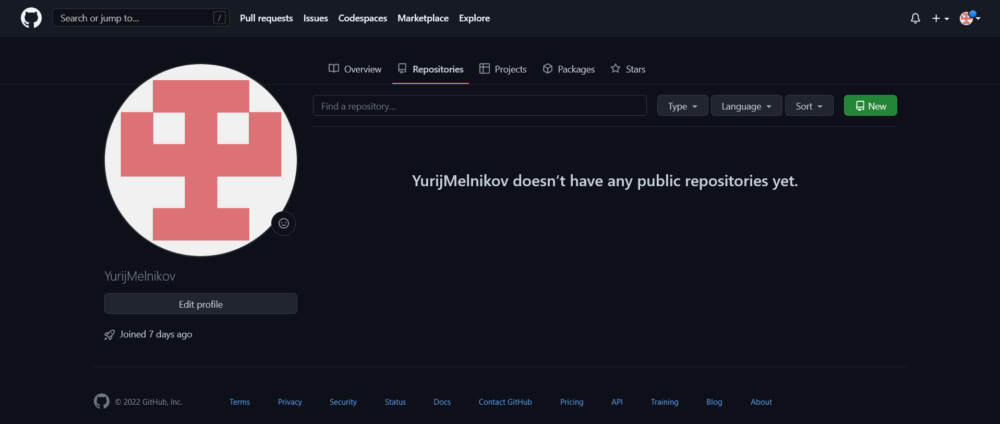
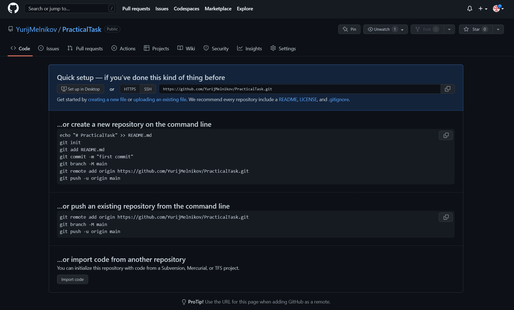
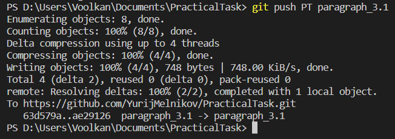
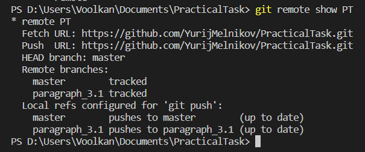

# Инструкция по работе с git
Сложная программа
## Что это и для чего нужна система контроля версий?

### Что такое система контроля версий?

Система управления версиями позволяет хранить несколько версий одного и того же документа, при необходимости возвращаться к более ранним версиям, определять, кто и когда сделал то или иное изменение, и многое другое.

### Для чего нужна система контроля версий

## Установка git и VSCode на ваш ПК.

***становка клиентских средств для Git
Пакет установки включает систему управления версиями Git и приложение командной строки Git Bash, используемое для взаимодействия с локальным репозиторием Git.

Установка клиентских средств Git для Windows
Скачайте Git для Windows.

Запустите скачанный исполняемый файл (.EXE) и следуйте инструкциям по установке. Щелкните Далее в каждом запросе, чтобы принять все параметры по умолчанию.

При появлении запроса выберите редактор кода. Редактор кода по умолчанию — Vim, который сложно использовать, если вы еще не знакомы с ним. Сведения об изменении редактора кода по умолчанию см. в статье Настройка редактора.

Щелкните Готово, чтобы завершить установку.***

### Установка VSCode на ваш ПК.

### Установка git на ваш ПК
 Чтобы установить Git в Arch Linux, необходимо выполнить команду sudo pacman -S git
 
#### Первая настройка git

## Создание и базовая работа с локальным репозиторием.

### Что такое репозиторий и инструкция по созданию локальных репозиториев.

Что такое репозиторий Git?
Репозиторий Git — это виртуальное хранилище проекта. В нем можно хранить версии кода для доступа по мере необходимости.

Инициализация нового репозитория: git init
Для создания нового репозитория используется команда git init. Команду git init выполняют только один раз для первоначальной настройки нового репозитория. Выполнение команды приведет к созданию нового подкаталога .git в вашем рабочем каталоге. Кроме того, будет создана новая главная ветка.

Создание версии существующего проекта с использованием нового репозитория Git
В этом примере предполагается, что у вас уже есть папка проекта, в которой вы и хотите создать репозиторий. Выполните команду cd для перехода к папке проекта, а затем выполните команду git init.

cd /path/to/your/existing/code 
git init
Указание в команде git init существующего каталога проекта приведет к исполнению описанной выше инициализации, но только на уровне этого каталога проекта.

git init <project directory>
Перейдите на страницу git init, чтобы получить подробные сведения о команде git init.

Клонирование существующего репозитория: git clone
Если проект уже настроен в центральном репозитории, наиболее распространенным способом создать его локальный клон является команда clone. Клонирование, как и команда git init, обычно выполняется один раз. Получив рабочую копию, разработчик в дальнейшем выполняет все операции контроля версий из своего локального репозитория.

git clone <repo url>
Команду git clone выполняют для создания копии (клонирования) удаленного репозитория. В качестве параметра в команду git clone передается URL-адрес репозитория. Git поддерживает несколько различных сетевых протоколов и соответствующих форматов URL-адресов. В этом примере используется SSH-протокол Git. URL-адреса SSH в Git имеют следующий шаблон: git@HOSTNAME:USERNAME/REPONAME.git

Пример URL-адреса SSH в Git имеет вид: git@bitbucket.org:rhyolight/javascript-data-store.git, а ниже приведены значения шаблонных параметров:

HOSTNAME: bitbucket.org
USERNAME: rhyolight
REPONAME: javascript-data-store
После исполнения команды последние версии файлов из главной ветки удаленного репозитория будут загружены и помещены в новый каталог. Имя нового каталога будет соответствовать параметру REPONAME. В данном случае это javascript-data-store. В каталоге будет вся история удаленного репозитория и только что созданная главная ветка.

Дополнительную информацию об использовании команды git clone и поддерживаемых форматах URL-адресов в Git см. на странице git clone.
### Базовая работа с локальным репозиторием

## Ветки. Локальная работа с ветками в git.

### Что такое ветки и для чего они нужны при работе с системой контроля версий.

### Базовая работа с ветками в git.

## Работа с удаленными репозиториями.

### Что такое удаленный репозиторий и для чего он нужен

### Базовая работа с удаленными репозиториями GitHub

Для организации коллективной работы над проектом, *git* имеет мощный инструментарий для работы над удалёнными репозиториями. Удалённый репозиторий может быть, как на личном компьютере, так и сервере локальной сети или в облачном сервисе. Одним из самых популярных интернет ресурсов для работы с удалёнными репозиториями является *github.com*, где сообщество программистов делится собственными наработками, улучшает и модифицирует уже имеющиеся репозитории ит.д. 

Для создания репозитория на *github.com* нужно перейти во вкладку *your repositories* и кликнуть *new*, в следующем окне ввести название репозитория, указать дополнительные настройки (видимость репозитория, добавление описания в README.MD ит.д.), под конец кликнуть на *Create repository*.

В итоге мы получили пустой репозиторий на *github.com* в который можно загрузить свой локальный. URL адрес является уникальным идентификатором этого репозитория, с которым мы в дальнейшем будем настраивать *git*.

Для связи удалённого репозитория c *git* на локальном компьютере существует команда:

>git remote add <имя> <URL удалённого репозитория>

где: "имя" - короткое, произвольное название удалённого репозитория, к которому будет проще обращаться в командной строек, и URL - интернет адрес удалённого репозитория.

Так же команда *git  remote* без модификаторов отображает весь список, связанных с локальным компьютером, удалённых репозиториев. Ключ *-v* позволяет просмотреть адреса для чтения и записи, привязанные к репозиторию.

>git remote

>git remote -v

Например:

Командой *git remote add* связали локальный компьютер с удалённым репозиторием с адресом [https://github.com/YurijMelnikov/PracticalTask.git](https://github.com/YurijMelnikov/PracticalTask.git "https://github.com/YurijMelnikov/PracticalTask.git") и присвоили ему локальное, короткое имя *PT*. Проверили, что всё прошло успешно командой *git remote* и *git remote -v*.

Для загрузки в удалённый репозиторий данных из локального репозитория существует команда *push* чаще всего использующаяся в формате:

>git push <имя удалённого репозитория> <имя ветки>

Где, имя удалённого репозитория - это короткое имя, которое мы присвоили командной git remote. А имя ветки - соответственно имя ветки локального репозитория, которую нужно загрузить в удалённый репозиторий.

Например:

Командой *git push PT master* отправили, в ранее настроенный удалённый репозиторий *PT*, ветку *master* (внимание: имена чувствительны к регистру).

Далее перенесём в удалённый репозиторий дополнительную ветку:

>Git Push PT paragraph_3.1

Соответственно в удалённый репозиторий была перенесена ветка *paragraph_3.1*, к уже имеющейся основной ветке *master*.

Так же можно добавлять в репозиторий файлы проекта, которые не нужно индексировать в *git*, например картинки - кнопкой Add file.

Для просмотра информации об удалённом репозитории, отслеживаемых ветках, URL адресе используется команда:

>Git remote show <имя репозитория>

Где "имя репозитория", короткое удобное имя, которое мы выбрали, когда связывали локальный и удалённый репозиторий командой *git remote add <имя> <URL удалённого репозитория>*

Так же имя удалённого репозитория при необходимости можно изменить командой:

>git remote rename <имя репозитория> <новое имя репозитория>

Соответственно данная команда изменит имя, заданное при выполнении команды *git remote add* на новое.

Если по какой-то причине нужно удалить удаленный репозиторий - можно использовать команду:

>git remote remove <имя репозитория>

При удалении - ссылки на удалённый репозиторий все отслеживаемые ветки и настройки, связанные с этим репозиторием, так же будут удалены.

## Совместная работа над проектом (fork, pull request)

### Как строится и для чего нужна совместная работа в системах контроля версий

### Инструкция по созданию pull request

## Книги и полезные ссылки по изучению git.

## Альтернативные системы контроля версий.
Существует множество различных систем контроля версий. Самые известные - CVS, Apache Subversion (SVN), Mercurial.

### Итак, какая система контроля версий подойдет для вашего проекта?

# Система одновременных версий (CVS)

# Apache Subversion (SVN)

